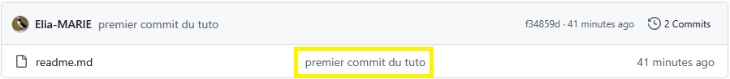

# Tutoriel initialisation Github

### Préalable

**Création d'un repo distant sur la plateforme Github**
1. Création d'un dossier sur le PC => c'est un dossier classique.
2. Création du premier fichier readme.md (qui va être la page d'accueil de notre repo)
3. Initialisation du dossier classique ; comme un repo local avec la commande `git init`<br>
Cette commande entraîne la créatiopn d'un sous répertoire **.git** et notre dossier "classique" local 
est devenu un repository au sens git du terme.
4. Ensuite, il faut *"stagger"* le fichier readme.md
```git add README.md```
5. Puis on *"commit"* avec l'option message -m (qui apparaîtra dans le repo github) 
```git commit -m "first commit```



6. Renommer la branche principale en main (car git en local a créer la branche 
master, mais github attend main par convention)
```git branch -M main```

7. Création du lien de notre repo local vers le repo distant
```git remote add origin https://github.com/Elia-MARIE/tuto_git_cpgeom.git```

8. Enfin, on *"push"* le repo local vers le distant
```git push -u origin main```

**Conclusion**

Notre repo local est jumelé avec le distant. Vu que je viens de compléter ce fichier readme après
le commit, je me contredis moi-même et je dois donc refaire  un commit pour être "iso".

